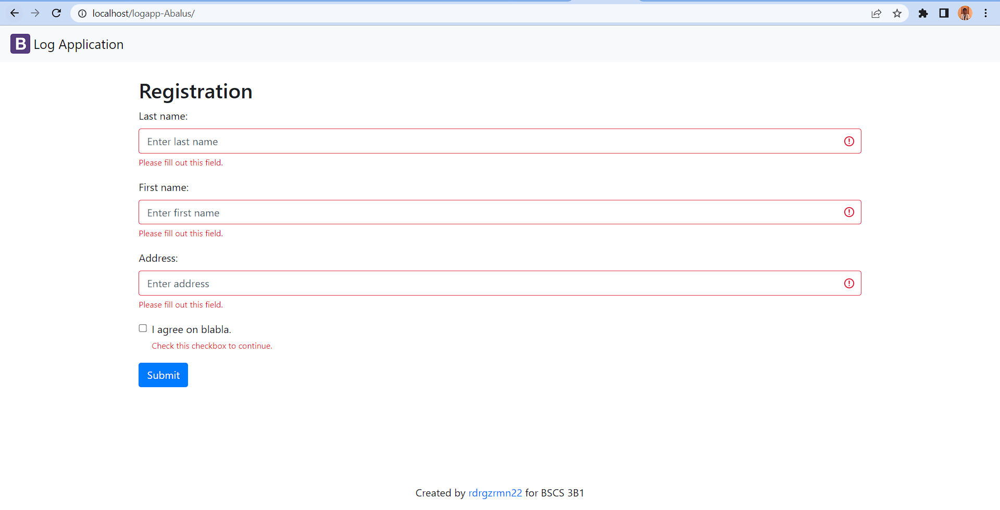
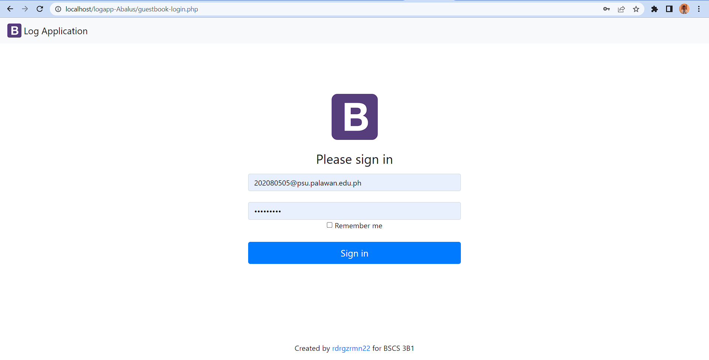
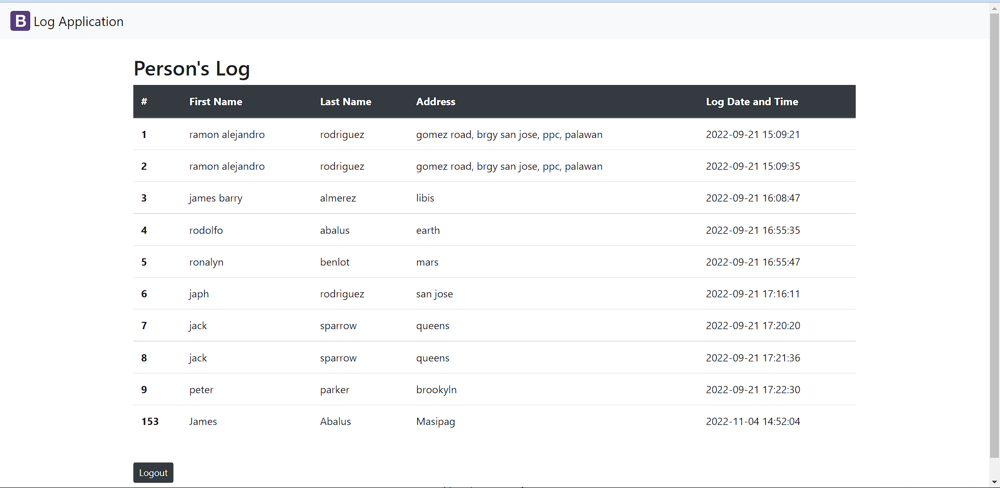
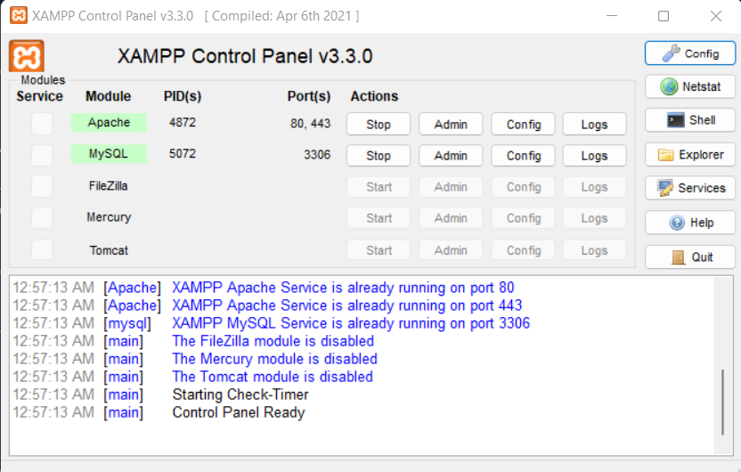
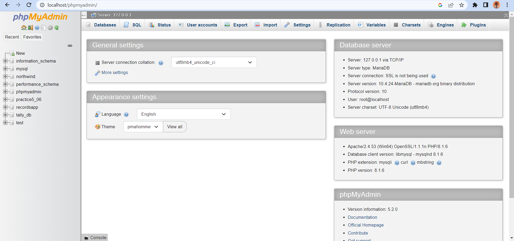

<h1 align="center"> logApp-ABALUS </h1>  

 
   
    

<h2 align="center"> COVID-19 Contact Tracing Application </h2>

  Together, we can kill this virus!  

## Description                 
                
This is a COVID-19 contact-tracing form application where people will be able to input their last name, first name, and their address. This information will be stored in a database (phpMyAdmin) where only the administrator(s) will be able to access the personal information that the people have entered. This application will surely secure the data you have entered and rest assured that the administrator(s) will not disclose the information to the public. 
                 
The main purpose of this application is to store people's data in a database for that covid officials to easily keep track of the information and whereabouts of the people that might be infected with a virus. Containment is one of the vital keys to stopping this pandemic.                                    
                 
This application aims to improve the speed of contact tracing for this may be available online. This being online will help people to reduce the covid transmission because you will not be able to have physical contact with another person will filling up this form.                 
             
                 
                 
##  Visuals

In here, you will see what the page look like. Here are the features of this application:  
                 
1.) **Contact Tracing Form** -
    This page is where the people will enter their information if they are suspected of having covid-19 virus.           
       
                 
2.) **Admin Login** - 
    This page is where the administator(s) will login their account to access the information that the people have entered.                  
      
                 
3.) **Data page** -
    This page is where all the information that the people have entered goes. Only administrator(s) can access and see what is inside this page.                         
                 

## Installation of phpMyAdmin
                 
This COVID Tracer Application uses phpMyAdmin as its database. PhpMyAdmin is an open source tool where you can administer your MariaDB database(s). It is pre-installed with your web hosting subscription. In phpMyAdmin you can, import, export, optimize or drop tables. If your website is using a database, this is where all the data of your site is stored.   

> ## Step One      
**Install **XAMPP**   
XAMPP is vital for phpMyAdmin to work   
XAMPP has the ability to serve web pages on the World Wide Web. A special tool is provided to password-protect the most important parts of the package. XAMPP also provides support for creating and manipulating databases in MariaDB and SQLite, among others.                    
                
> ## Step Two
**Install **Apache**, **PHP**, and **MySQL**  
Apache, PHP, and MySQL must all be installed and configured on your computer before you can install phpMyAdmin in this way.  

Apache is the most commonly used Web server on Linux systems. Web servers are used to serve Web pages requested by client computers. Clients typically request and view Web pages using Web browser applications such as Firefox, Opera, Chromium, or Internet Explorer.  
PHP is mostly used for making web servers. It runs on the browser and is also capable of running in the command line. So, if you don't feel like showing your code output in the browser, you can show it in the terminal.   
 MySQL is a tool used to manage databases and servers, so while it's not a database, it's widely used in relation to managing and organising data in databases.                  
> ## Step Three
 ** Open XAMPP and in in XAMPP Control Panel, Start the Apache and MySQL    
       
                 
> ## Step Four
 ** Open your browser and type localhost/phpMyAdmin  
                       

## Author
                 
   
                 
<h2 align="left"> JAMES RODOLFO L. ABALUS </h2>
He is the author of this repository and this logApp.  He is studying Computer Science at Palawan State University.  Lives at Puerto Princesa City, Palawan, Philippines 5300.   **Contact Number: 09063430592   **Email: 202080505@psu.palawan.edu.ph / jamesabalus20@gmail.com
